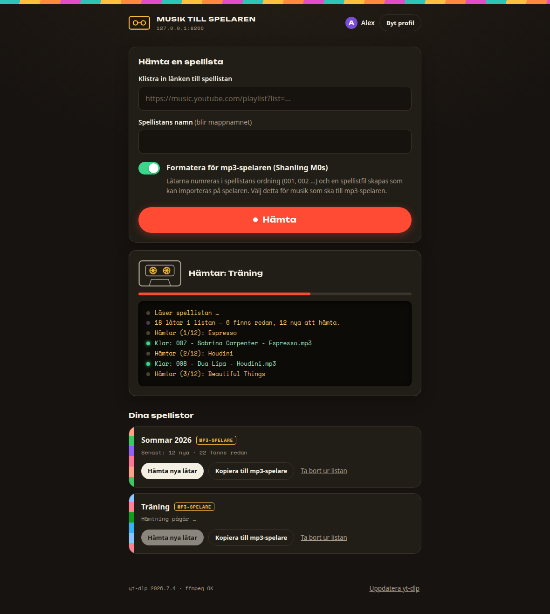
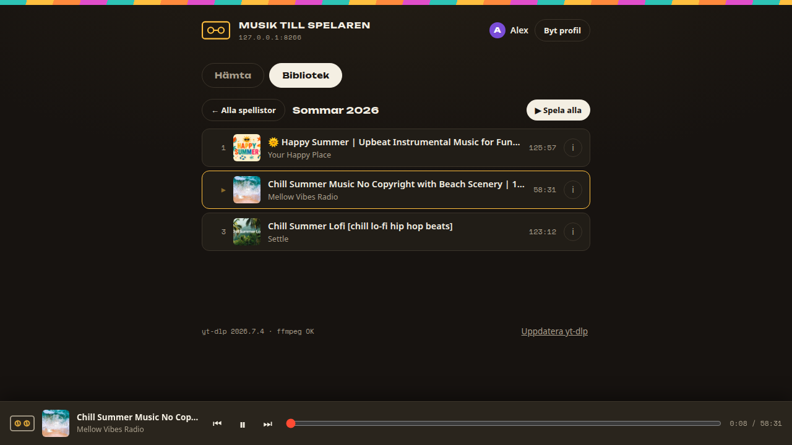
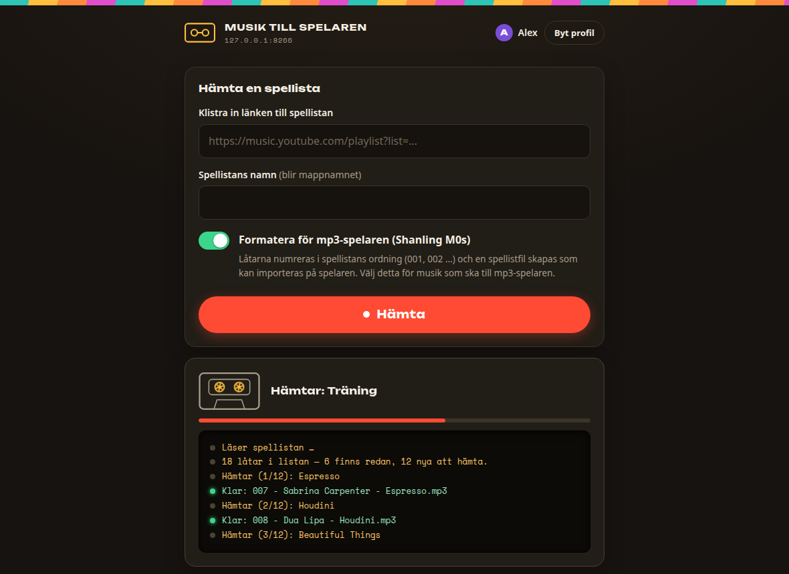

# 📼 Musik till spelaren (ytmusic-dl)

> **In English:** Self-hosted web app for a Synology NAS that downloads
> YouTube Music playlists as MP3s into each family member's own home folder,
> formatted for a classic MP3 player (Shanling M0s) — with a built-in library
> view and in-browser player. The app UI is in Swedish, and so is the rest of
> this README.

En självhostad webbapp för familjens NAS: klistra in en YouTube
Music-spellista och få den nedladdad som MP3 rakt in i din egen hemkatalog,
färdigformaterad för en klassisk mp3-spelare. Byggd för att en datorovan
14-åring ska kunna använda den utan instruktioner — och för att en förälder
ska slippa underhålla den.



## Vad den gör

- **Klistra in en länk → få MP3:or.** Bästa tillgängliga ljudkvalitet, rena
  ID3-taggar och kvadratiskt beskuret inbäddat omslag (som små spelarskärmar
  visar bäst).
- **Flera användare utan kontokrångel.** Profiler mappar 1:1 mot NAS:ens
  hemkataloger (`/volume2/homes/<användare>`). Nya Synology-konton dyker upp
  automatiskt. Lösenord är valfritt per profil — tomt fält ger
  ettklicksprofil.
- **Rätt filägare.** Varje nedladdningsjobb körs som profilägarens uid/gid,
  så filerna är direkt redigerbara över SMB.
- **Inkrementell.** Ett arkiv per spellista gör att omkörningar bara hämtar
  nya låtar. En växande spellista är grundanvändningsfallet.
- **Numret på disk = spårets position i spellistan, alltid.** En id→fil-karta
  per mapp numrerar om filerna när listan ändras. Låtar som strukits ur
  listan behåller sin fil men förlorar numret.
- **Mp3-spelarläge** (per spellista, på som standard): numrerade filnamn
  (`001 - Artist - Titel.mp3`) plus en `.m3u` med relativa sökvägar så som
  Shanling M0s vill ha den. Av ger rena `Artist - Titel.mp3`-filer.
- **Bibliotek med spelare.** Hylla med spellistorna som omslagscollage,
  spårlistor med skivomslag, faktaruta per låt (artist, titel, längd,
  ljudkvalitet, filstorlek, hämtdatum) och en fast mini-spelare — kassettens
  rullar snurrar medan musiken spelar. Senast spelade låten överlever
  sidladdningar.
- **Självläkande nedladdningar.** Borttagna videor ersätts automatiskt med
  en annan utgåva av samma låt (längdmatchning, officiella uppladdningar
  premieras) — och omslaget hämtas då från originalspåret eller iTunes så
  det blir albumkonst, inte en videoruta.
- **YouTube-konto, valfritt per profil** (cookies.txt): låser upp kontolåsta
  spår och privata spellistor, och med Premium-prenumeration blir ljudet
  256 kbit/s. Som standard används kontot bara när anonym hämtning nekas.
- **Snäll mot YouTube och NAS:en.** En sekventiell hämtningskö med slumpade
  pauser mellan låtarna — och tydlig kö-status i UI:t, med avbryt-knapp.
- **Självuppdaterande yt-dlp** vid varje containerstart plus en knapp i UI:t;
  arbetaren läser in yt-dlp färskt per jobb, så uppdateringar gäller utan
  omstart.
- **Kopiera direkt till spelaren.** I Chrome/Edge över HTTPS synkar en knapp
  bara nya låtar rakt till minneskortet (File System Access API) och städar
  bort omdöpta gamla filer.
- **Begripliga fel på svenska.** Privat spellista? Bot-kontroll? Avbruten av
  omstart? Appen förklarar vad som hänt och vad man gör åt det, där man
  tittar.





## Hur den funkar

FastAPI-backend + vanilla JS-frontend i en enda container. Nedladdningar via
[yt-dlp](https://github.com/yt-dlp/yt-dlp) som bibliotek med ffmpeg för
MP3-konvertering och omslagsinbäddning; Deno finns i imagen för yt-dlp:s
JavaScript-utmaningslösare (krävs för inloggade sessioner). Jobben köas och
körs ett i taget av en arbetarprocess som byter till profilägarens
uid/gid innan något skrivs. Profiler och jobbhistorik ligger i en liten
SQLite-databas.

Utdatastruktur per användare:

```
<hem>/Musik/Spelaren/
  <Spellistans namn>/
    001 - Artist - Titel.mp3
    _archive.txt              ← dubblettskydd (yt-dlp-format)
    _tracks.json              ← id→fil-karta för omnumrering
  _explaylist_data/
    <Spellistans namn>.m3u    ← relativa sökvägar, regenereras varje körning
```

Kopiera `Musik/Spelaren/` till spelarens minneskort som den är —
mappstrukturen speglar kortet.

## Kom igång

Kräver en Docker-värd med de hemkataloger som ska serveras.

```bash
git clone https://github.com/cgillinger/ytmusic-dl.git
cd ytmusic-dl
mkdir data          # måste finnas före första starten (Synology skapar den inte)
docker compose up -d --build
```

Öppna `http://<värd>:8201`, skapa en profil, klistra in en spellistlänk.

### Konfiguration (miljövariabler)

| Variabel | Standard | Syfte |
|----------|----------|-------|
| `HOMES_DIR` | `/homes` | Var hemkatalogerna är monterade |
| `DATA_DIR` | `/data` | SQLite-databas + sessionshemlighet + cookies |
| `PORT` | `8201` | HTTP-port |
| `HOMES_EXCLUDE` | *(tom)* | Kommaseparerade konton som döljs i profilväljaren (`admin`/`guest` döljs alltid) |

Lägg platsspecifika värden i en `docker-compose.override.yml` (gitignorad).

### Synology-noter

- Compose-filen monterar `/volume2/homes` — anpassa till din volym.
- Containern måste köra som **root** (den byter användare per jobb); lägg
  inte till något `user:`-direktiv.
- För "Kopiera till mp3-spelare"-knappen krävs HTTPS: lägg en omvänd
  proxy-regel i DSM (Kontrollpanelen → Inloggningsportal → Avancerat →
  Omvänd proxy) från en HTTPS-port till `http://localhost:8201`.
  Självsignerat certifikat räcker — exponera ingenting mot internet.

## Om privata spellistor

YouTube Music-spellistor är **privata som standard**, och sådana kan inte
läsas anonymt. Två lösningar: sätt listan till **Olistad** (⋮ → Redigera
spellista → Sekretess — fortfarande dold för alla utan länken), eller koppla
ett YouTube-konto till profilen. Cookie-exporten görs säkrast från ett
inkognitofönster som stängs efteråt (tillägget *Get cookies.txt LOCALLY*
länkas med steg-för-steg-guide direkt i appen).

## Juridik

Verktyget är avsett för **privat bruk** (i Sverige: privatkopiering enligt
12 § upphovsrättslagen). Nedladdning från YouTube kan bryta mot YouTubes
användarvillkor och rättsläget skiljer sig mellan länder — du ansvarar
själv för hur du använder programvaran. Inte anslutet till YouTube eller
Shanling.
